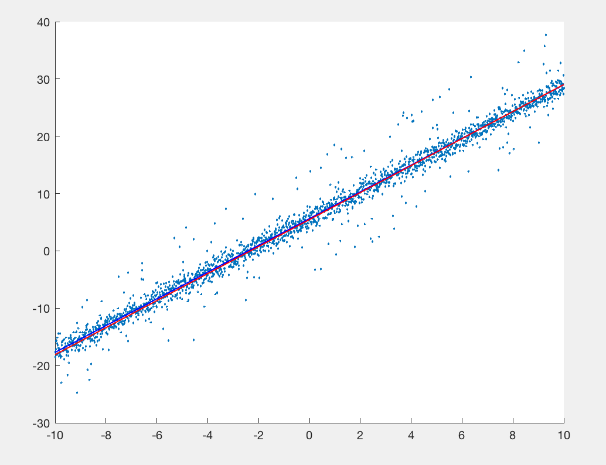
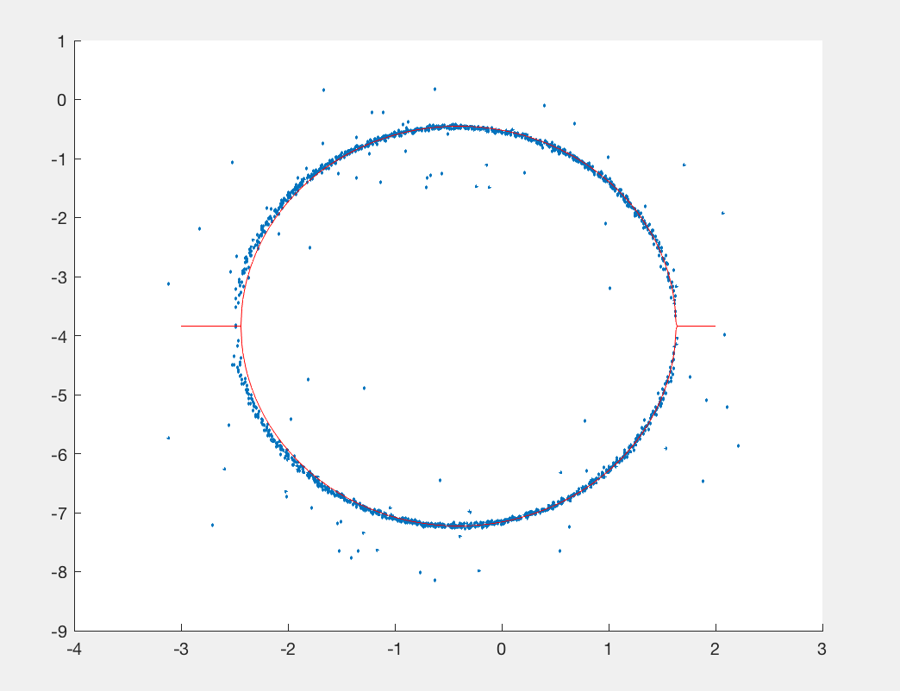
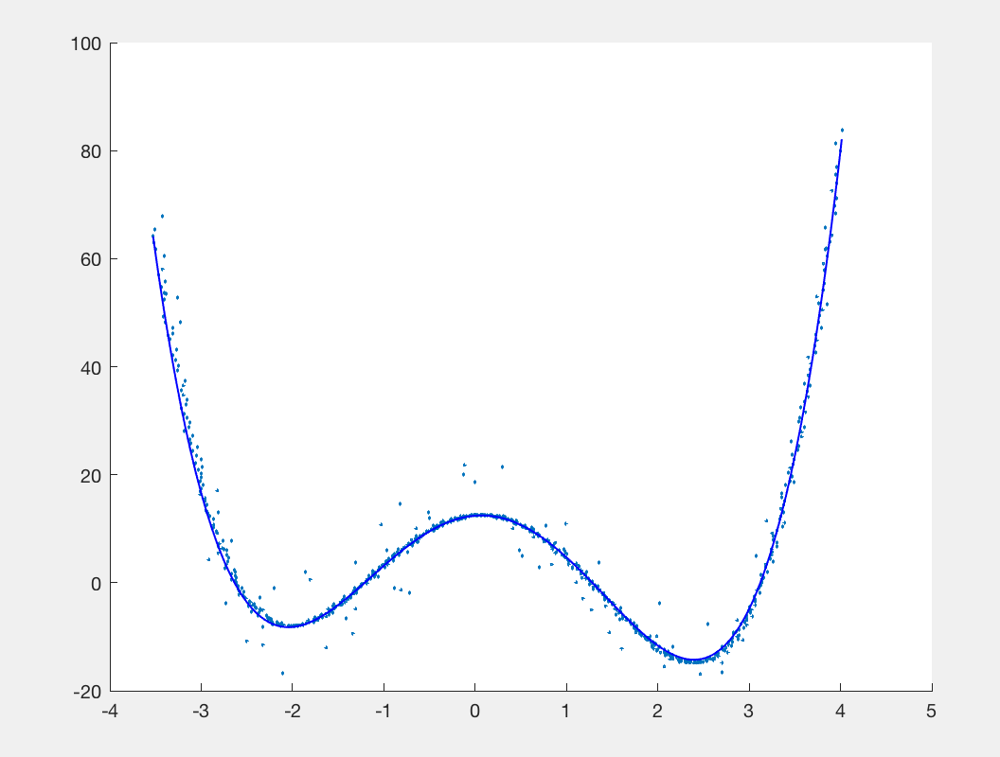
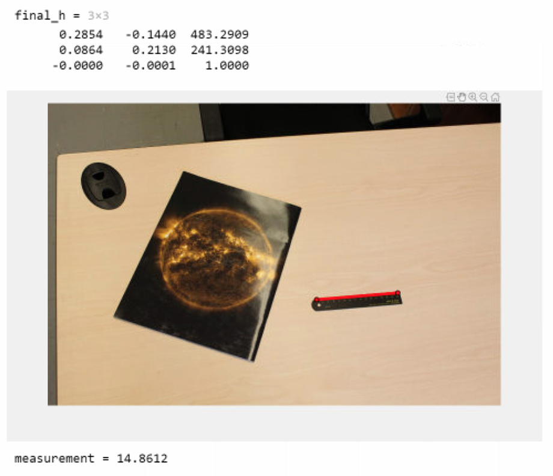
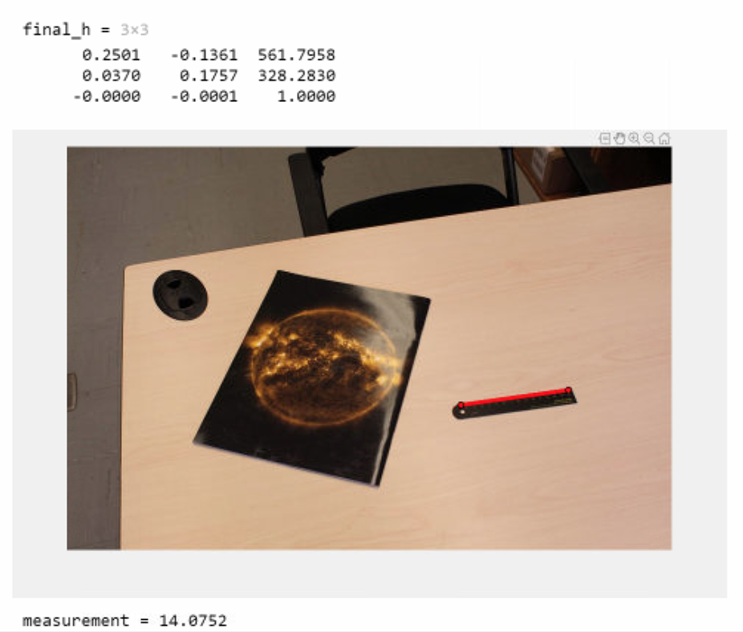

## Task 5 Image Stitching and RANSAC
**Name:** Tianyi Yu  
**Degree:** BA  
**ID:** 20550150

### Problem 1
---
##### (a)
Gaussian kernel is separable and can be applied to a 2D image as two independent 1D calculations. It can be expressed as the product of two functions, one a function of x and the other a function of y.
Applying multiple, successive Gaussian blurs to an image has the same effect as applying a single, larger Gaussian blur, whose radius is the square root of the sum of the squares of the blur radii that were actually applied. Because of this relationship, processing time cannot be saved by simulating a Gaussian blur with successive, smaller blurs — the time required will be at least as great as performing the single large blur. However, separability still reduces the complexity of filtering an image since a 2D convolution can be reduced to two 1D convolutions.

##### (b)
The LOG module performs a Laplacian of Gaussian filter. This filter first applies a Gaussian blur, then applies the Laplacian filter and finally checks for zero crossings. The end result of this filter is to highlight edges.
The first stage of the filter uses a Gaussian blur to blur the image in order to make the Laplacian filter less sensitive to noise.

##### (c)
Gaussian kernal is separable. However, 2D Laplacian kernal is not separable. In this case, LoG is not separable.

##### (d)
Difference of Gaussians is a feature enhancement algorithm that involves the subtraction of one blurred version of an original image from another, less blurred version of the original. Blurring an image using a Gaussian kernel suppresses only high-frequency spatial information. Subtracting one image from the other preserves spatial information that lies between the range of frequencies that are preserved in the two blurred images. Thus, the difference of Gaussians is a band-pass filter that discards all but a handful of spatial frequencies that are present in the original grayscale image.

When utilized for image enhancement, the difference of Gaussians algorithm is typically applied when the size ratio of kernel (2) to kernel (1) is 4:1 or 5:1. The algorithm can also be used to obtain an approximation of the Laplacian of Gaussian when the ratio of size 2 to size 1 is roughly equal to 1.6.

### Problem 2
---
##### (a)
Approach 1 is directly line fitting and minimizing the differences between each set of y points. Approach 2 involves matrices and calculates the two coefficients together in a matrix.

##### (b)
```matlab
clc; clear all; close all;

% (b)

load('prob2_data1.mat','x','y');

n = length(x);
m1 = (sum(x.*y)-1/n*(sum(x)*sum(y)))/(sum(x.^2)-1/n*((sum(x))^2))
b1 = (1/n*sum(y)*sum(x.^2)-1/n*sum(x)*sum(x.*y))/(sum(x.^2)-1/n*((sum(x))^2))
```
Results  
m=1.6540  
b=2.3197

##### (c)
```matlab
% (c)

x1 = [transpose(x) ones(n,1)];

y1 = transpose(y);

mb = inv(transpose(x1)*x1)*transpose(x1)*y1;

m2 = mb(1)

b2 = mb(2)
```
Results  
m=1.6540  
b=2.3197


##### (d)
```matlab
clc; clear all;

load('prob2_data2.mat','x','y');
m = length(x);
x1 = [transpose(x) ones(m,1)];

y1 = transpose(y);

mb = inv(transpose(x1)*x1)*transpose(x1)*y1;

m1 = mb(1)

b1 = mb(2)
```
Results  
m=2.3348  
b=5.6458

##### (e)
```matlab

m2 = [];
b2 = [];
diff=inf;

p = 0.99;
err = 0.5;
n = 2;

N = ceil(log(1-p)./log(1-(1-err)^n))


for i=1:N
    a=randi(m,1,1);
    b=randi(m,1,1);
    x2=[x(a) x(b)];
    y2=[y(a) y(b)];
    mb2(i,:)=polyfit(x2,y2,1);
    diff1=abs(y-polyval(mb2(i,:),x));
    thd=1;
    valid=diff1<thd;
    inlier(i,:)=sum(valid);
end

[value,index]=max(inlier);

m2=mb2(index,1)
b2=mb2(index,2)

xmb1=[min(x) max(x)];
ymb1=[m1*xmb1(1)+b1 m1*xmb1(2)+b1];
ymb2=[m2*xmb1(1)+b2 m2*xmb1(2)+b2];

figure(1)
scatter(x,y,1); hold on;
plot(xmb1,ymb1,'b-','LineWidth',1);
plot(xmb1,ymb2,'r-','LineWidth',1);
```
Results  
m=2.3569  
b=5.4644


##### (f)
Least square method is easy to apply and works well in polynomial fitting. RANSAC is more complicated but it can remove the outliers and thus is suitable for the cases when there are many outliers.

### Problem 3
---
##### (a)
```matlab
load('prob3_ellipse.mat','x','y');


p = 0.99;
err = 0.5;
n = 4;

N = ceil(log(1-p)./log(1-(1-err)^n))

m=length(x);

% From the plot, the ellipse is not tilted or oriented, so term x*y has a coefficient of ~0.
% In this case, four points are required to determine the four coefficients.


for i=1:N
    p=randi(m,1,1);
    q=randi(m,1,1);
    r=randi(m,1,1);
    s=randi(m,1,1);
    row1=[x(p)^2 y(p)^2 x(p) y(p) 1];
    row2=[x(q)^2 y(q)^2 x(q) y(q) 1];
    row3=[x(r)^2 y(r)^2 x(r) y(r) 1];
    row4=[x(s)^2 y(s)^2 x(s) y(s) 1];
    matrix1=[row1;row2;row3;row4];
    coeff=null(matrix1);
    a(i,:)=coeff(1);
    b(i,:)=coeff(2);
    c(i,:)=coeff(3);
    d(i,:)=coeff(4);
    e(i,:)=coeff(5);
    diff1=abs(y-(sqrt(-a(i)/b(i)*x.^2-c(i)/b(i)*x-e(i)/b(i)+(d(i)^2)/(4*b(i)^2))-d(i)/(2*b(i))));
    thd=1;
    valid=diff1<thd;
    inlier(i,:)=sum(valid);
end

[value,index]=max(inlier);

a1=a(index);
b1=b(index);
c1=c(index);
d1=d(index);
e1=e(index);

xplot=[-3:0.01:2];
yplot1=sqrt(-a1/b1*xplot.^2-c1/b1*xplot-e1/b1+(d1^2)/(4*b1^2))-d1/(2*b1);
yplot2=-(sqrt(-a1/b1*xplot.^2-c1/b1*xplot-e1/b1+(d1^2)/(4*b1^2)))-d1/(2*b1);

figure(1)
scatter(x,y,1); hold on;
plot(xplot,yplot1,'r-'); 
plot(xplot,yplot2,'r-');
```


##### (b)
```
load('prob3_polynomial.mat','x','y');


p = 0.99;
err = 0.5;
n = 5;

N = ceil(log(1-p)./log(1-(1-err)^n))

m=length(x);

% 5 coefficients, 4 points for fitting.


for i=1:N
    p=randi(m,1,1);
    q=randi(m,1,1);
    r=randi(m,1,1);
    s=randi(m,1,1);
    t=randi(m,1,1);
    x1=[x(p) x(q) x(r) x(s) x(t)];
    y1=[y(p) y(q) y(r) y(s) y(t)];
    coeff(i,:)=polyfit(x1,y1,4);
    diff=abs(y-polyval(coeff(i,:),x));
    thd=1;
    valid=diff<thd;
    inlier(i,:)=sum(valid);
end

[value,index]=max(inlier);

a=coeff(index,1)
b=coeff(index,2)
c=coeff(index,3)
d=coeff(index,4)
e=coeff(index,5)

xplot=[min(x):0.01:max(x)];
yplot=a*xplot.^4+b*xplot.^3+c*xplot.^2+d*xplot+e;

figure(1)
scatter(x,y,1); hold on;
plot(xplot,yplot,'b-','LineWidth',1);
```


### Problem 4
---

```matlab
clc; clear all; close all;

cover = imread('cover.jpg');
I = imread('IMG_0087.JPG');
cover = single(rgb2gray(cover));
Ia = single(rgb2gray(I));

info = imfinfo('cover.jpg');
sizePic = [info.Width info.Height];

[fa, da] = vl_sift(cover,'PeakThresh', 5) ;
[fb, db] = vl_sift(Ia,'PeakThresh', 5) ;
[matches, scores] = vl_ubcmatch(da, db);

figure(1)
subplot (1,2,1);
imshow (uint8(cover));
hold on;
plot (fa(1,matches(1,:)), fa(2, matches(1,:)), 'b*');
subplot (1,2,2);
imshow (uint8 (Ia));
hold on;
plot (fb(1, matches(2,:)), fb(2, matches (2,:)), 'r*');


p = 0.99;
err = 0.3;
n = 8;

N = ceil(log(1-p)./log(1-(1-err)^n));

for i=1:200
    perm = randperm(size(matches,2));
    sel=perm(:,1:4);
    xx = fa(1,matches(1,sel));
    yy = fa(2,matches(1,sel));
    aa = fb(1,matches(2,sel));
    bb = fb(2,matches(2,sel));
    x1=xx(1);
    x2=xx(2);
    x3=xx(3);
    x4=xx(4);
    y1=yy(1);
    y2=yy(2);
    y3=yy(3);
    y4=yy(4);
    a1=aa(1);
    a2=aa(2);
    a3=aa(3);
    a4=aa(4);
    b1=bb(1);
    b2=bb(2);
    b3=bb(3);
    b4=bb(4);
    A = sym([x1 y1 1 0 0 0 -x1*a1 -y1*a1 -a1;...
    0 0 0 x1 y1 1 -x1*b1 -y1*b1 -b1;...
    x2 y2 1 0 0 0 -x2*a2 -y2*a2 -a2;...
    0 0 0 x2 y2 1 -x2*b2 -y2*b2 -b2;...
    x3 y3 1 0 0 0 -x3*a3 -y3*a3 -a3;...
    0 0 0 x3 y3 1 -x3*b3 -y3*b3 -b3;...
    x4 y4 1 0 0 0 -x4*a4 -y4*a4 -a4;...
    0 0 0 x4 y4 1 -x4*b4 -y4*b4 -b4]);
    HHH = null(A);
    HH = HHH(:,1);
    H(:,i) = HH;
    h = [HH(1) HH(2) HH(3);HH(4) HH(5) HH(6);HH(7) HH(8) HH(9)];
    h=double(h);
    fa_new = [fa(1,(matches(1,:))); fa(2,(matches(1,:))); ones(1,size(matches,2))];
    pts_homo = h*fa_new;
    p1=[pts_homo(1,:)./pts_homo(3,:);pts_homo(2,:)./pts_homo(3,:)];
    p2=fb(1:2,matches(2,:));
    thd=1;
    diff=((p1(1,:)-p2(1,:)).^2 - (p1(2,:)-p2(2,:)).^2).^(1/2);
    valid=abs(diff)<thd;
    inlier(i,:)=sum(valid);
end

[value,index]=max(inlier);

hh=H(:,index);
final_h=[hh(1) hh(2) hh(3);hh(4) hh(5) hh(6);hh(7) hh(8) hh(9)];
final_h=double(final_h)

figure(2); imshow(I);
q = drawpolyline('LineWidth',4,'Color','red');
 
corner = q.Position;
 
corner1 = [corner(1,1) corner(2,1); corner(1,2) corner(2,2); 1 1];
 
corner2 = inv(final_h)*corner1;
 
point1 = [corner2(1,1)/corner2(3,1);corner2(2,1)/corner2(3,1)];
 
point2 = [corner2(1,2)/corner2(3,2);corner2(2,2)/corner2(3,2)];
 
pixels = norm(point1 - point2);

measurement = pixels/sizePic(1)*24
end
```
Two of the outputs are attached below.




The two tools are similar in terms of the accuracy of the results. However, the new tool doesn't require a polygon to be specified and would speed up the transformation if multiple images are being processed.

### Problem 5
```matlab
clc; clear all; close all;

cover = imread('deep_goodfellow.jpg');
I = imread('IMG_0212.JPG');
cover = single(rgb2gray(cover));
Ia = single(rgb2gray(I));

info = imfinfo('deep_goodfellow.jpg');
sizePic = [info.Width info.Height];

[fa, da] = vl_sift(cover,'PeakThresh', 5) ;
[fb, db] = vl_sift(Ia,'PeakThresh', 5) ;
[matches, scores] = vl_ubcmatch(da, db);

figure(1)
subplot (1,2,1);
imshow (uint8(cover));
hold on;
plot (fa(1,matches(1,:)), fa(2, matches(1,:)), 'b*');
subplot (1,2,2);
imshow (uint8 (Ia));
hold on;
plot (fb(1, matches(2,:)), fb(2, matches (2,:)), 'r*');


p = 0.99;
err = 0.3;
n = 8;

N = ceil(log(1-p)./log(1-(1-err)^n));

for i=1:200
    perm = randperm(size(matches,2));
    sel=perm(:,1:4);
    xx = fa(1,matches(1,sel));
    yy = fa(2,matches(1,sel));
    aa = fb(1,matches(2,sel));
    bb = fb(2,matches(2,sel));
    x1=xx(1);
    x2=xx(2);
    x3=xx(3);
    x4=xx(4);
    y1=yy(1);
    y2=yy(2);
    y3=yy(3);
    y4=yy(4);
    a1=aa(1);
    a2=aa(2);
    a3=aa(3);
    a4=aa(4);
    b1=bb(1);
    b2=bb(2);
    b3=bb(3);
    b4=bb(4);
    A = sym([x1 y1 1 0 0 0 -x1*a1 -y1*a1 -a1;...
    0 0 0 x1 y1 1 -x1*b1 -y1*b1 -b1;...
    x2 y2 1 0 0 0 -x2*a2 -y2*a2 -a2;...
    0 0 0 x2 y2 1 -x2*b2 -y2*b2 -b2;...
    x3 y3 1 0 0 0 -x3*a3 -y3*a3 -a3;...
    0 0 0 x3 y3 1 -x3*b3 -y3*b3 -b3;...
    x4 y4 1 0 0 0 -x4*a4 -y4*a4 -a4;...
    0 0 0 x4 y4 1 -x4*b4 -y4*b4 -b4]);
    HHH = null(A);
    HH = HHH(:,1);
    H(:,i) = HH;
    h = [HH(1) HH(2) HH(3);HH(4) HH(5) HH(6);HH(7) HH(8) HH(9)];
    h=double(h);
    fa_new = [fa(1,(matches(1,:))); fa(2,(matches(1,:))); ones(1,size(matches,2))];
    pts_homo = h*fa_new;
    p1=[pts_homo(1,:)./pts_homo(3,:);pts_homo(2,:)./pts_homo(3,:)];
    p2=fb(1:2,matches(2,:));
    thd=1;
    diff=((p1(1,:)-p2(1,:)).^2 - (p1(2,:)-p2(2,:)).^2).^(1/2);
    valid=abs(diff)<thd;
    inlier(i,:)=sum(valid);
end

[value,index]=max(inlier);

hh=H(:,index);
final_h=[hh(1) hh(2) hh(3);hh(4) hh(5) hh(6);hh(7) hh(8) hh(9)];
final_h=double(final_h)

p = [0 0 sizePic(1) sizePic(1); 0 sizePic(2) sizePic(2) 0; 1,1,1,1];
pnew = final_h*p;
points = [pnew(1,:)./pnewo(3,:);pnew(2,:)./pnew(3,:)];

figure(2); imshow(I); hold on;
plot(points(1,:),points(2,:),'ob','LineWidth', 2);
plot([points(1,:),points(1,1)],[points(2,:),points(2,1),'-r','LineWidth', 2);
```
I used MATLAB on Macbook to write this code and it doesn't allow me load any folders. In this case I only write one iteration of the detection out of the four books.


